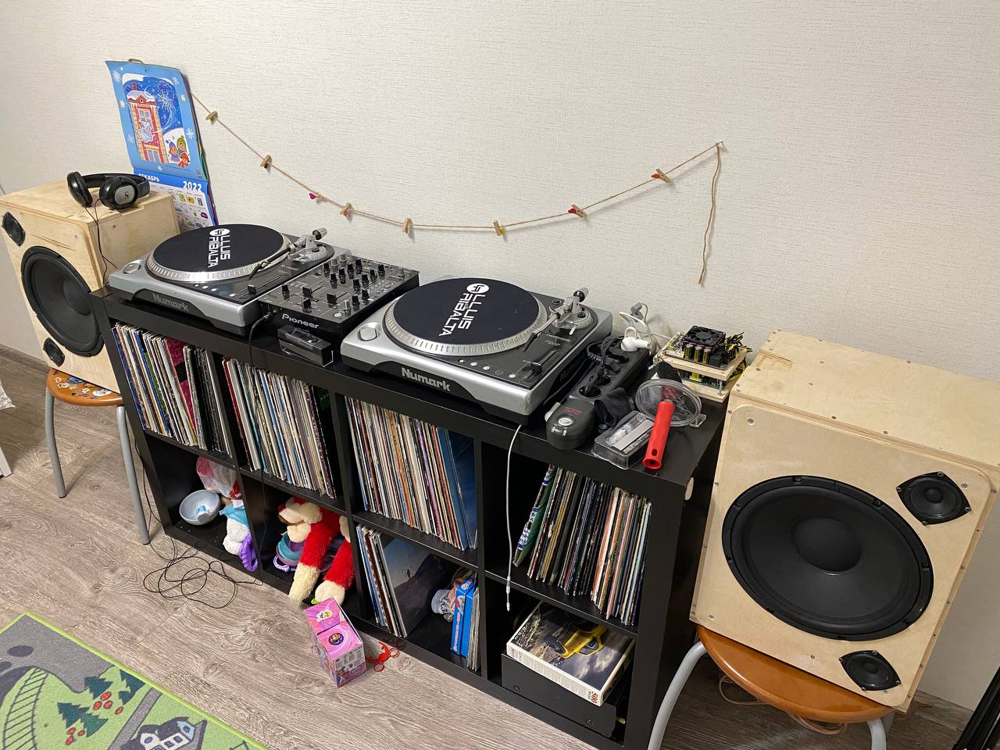
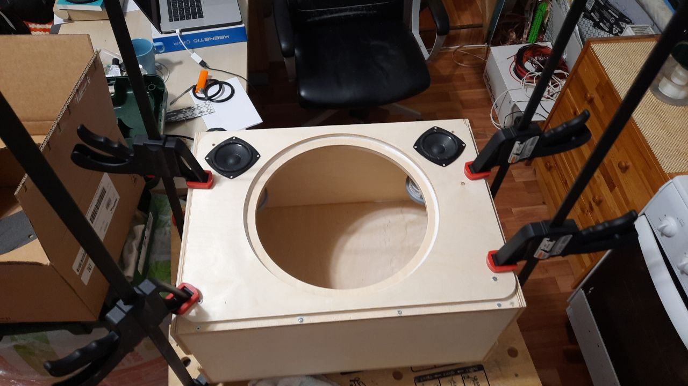

# 🔊 ZeroPassive BoomBox

**ZeroPassive BoomBox** is a compact, bi-amped speaker system designed specifically for DJs. Built around the **Wondom JAB5 amplifier with ADAU1701 DSP**, this box delivers clean, powerful bass and accurate mids and highs — without any passive crossovers.

Just DSP. Just punch. Built to shake the room without breaking the bank.

---

## 🚀 Features

- 🎛️ **Bi-amped 2-way speaker system**  
  Separate amplification and digital processing for each driver.

- 🧠 **Fully digital signal path**  
  All filtering, EQ, and crossover handled by DSP (SigmaStudio project included).

- 🔧 **Custom firmware for Wondom JAB5**  
  Plug-and-play, tuned for Bluetooth input by default.

- 🎚️ **Tuned for live DJ use**  
  Strong low-end, fast transient response, optimized for mixing and playback.

- 💰 **High-performance on a budget**  
  Professional-grade architecture at a DIY-friendly price point.

---

## 🛠️ What's Inside

- **Electronics:**
  - Amplifier: [Wondom JAB5 (ADAU1701 DSP)](https://files.sure-electronics.com/download/JAB5.pdf)
  - Digital Crossover: Custom SigmaStudio project
  - Power Supply: 24V, >300W DC

- **Drivers:**
  - 2× [Beyma 12BR70](https://www.beyma.com/speakers/Fichas_Tecnicas/beyma-speakers-data-sheet-low-mid-frequency-12BR70.pdf) (woofer)
  - 4× [Beyma 3FR30V2](https://www.beyma.com/speakers/Fichas_Tecnicas/beyma-speakers-data-sheet-full-range-3FR30V2.pdf) (mid/high)

- **Enclosure:**
  - Separated internal chamber for mid/high drivers (using PVC pipes Ø75 mm with caps)
  - MDF or plywood, 8–10 mm, approx. 8–10L per speaker

---

## 🧰 Bill of Materials (for 2 speakers)

| Component                        | Quantity | Unit Price (EUR) | Total (EUR) |
|----------------------------------|----------|------------------|-------------|
| Beyma 3FR30V2 (mid/high)         | 4 pcs    | ~25 €            | 100 €       |
| Beyma 12BR70 (woofer)            | 2 pcs    | ~85 €            | 170 €       |
| Wondom JAB5 with Bluetooth       | 1 pc     | ~70 €            | 70 €        |
| Power Supply (24V, 300–350W)     | 1 pc     | ~40 €            | 40 €        |
| Enclosure materials (MDF, glue)  | -        | ~40 €            | 40 €        |
| Vibration damping (StP F200)     | 1 pack   | ~15 €            | 15 €        |
| Cables, connectors, terminals    | -        | ~15 €            | 15 €        |
| PVC pipes Ø75 mm + end caps      | 2 pcs    | ~5 €             | 10 €        |
| Bluetooth antenna + misc. parts  | -        | ~7 €             | 7 €         |

**Total:** ~467 € for 2 speakers (approx. **233 € per speaker**)

---

